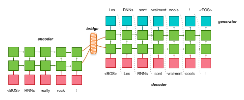
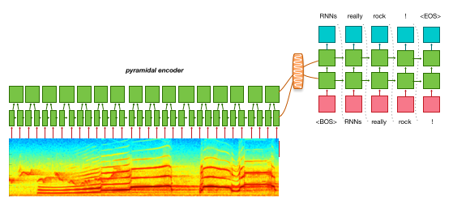
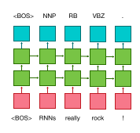
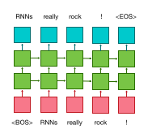

## Machine Translation

Neural Machine Translation (NMT) is the default and original task for OpenNMT. It requires a corpus of bilingual sentences for instance as available on [Opus](http://opus.lingfil.uu.se) for a very large variety of domains and language pairs.

Training a NMT engine is a 3 steps process:

* [Tokenization](/tools/tokenization/)
* Preprocessing
* Training

Step by step process is described on the [quickstart page](/quickstart/) and full process to train large system is described on the forum [here](http://forum.opennmt.net/t/training-english-german-wmt15-nmt-engine/29).

## Summarization

Summarization models are trained exactly like NMT models. However, the nature of the training data is different: source corpus are full length document or articles, and target are summaries.

[This forum post](http://forum.opennmt.net/t/text-summarization-on-gigaword-and-rouge-scoring/85/) details how to train and evaluate a summarization model.

## Image to text

*Im2Text*, developed by Yuntian Deng from the Harvard NLP group, is implementing a generic image-to-text application on top of OpenNMT libraries for [visual markup decompilation](https://arxiv.org/pdf/1609.04938v1.pdf). The main modification to the vanilla OpenNMT is an encoder introducing CNN layers in combination with RNN.

## Speech recognition

While OpenNMT is not primarily targetting speech recognition applications, its ability to support [input vectors](/data/preparation/#input-vectors) and [pyramidal RNN](/training/models/#pyramidal-deep-bidirectional-encoder) makes possible end-to-end experiments on speech to text applications as described for instance in [Listen, Attend and Spell](https://arxiv.org/abs/1508.01211).

See for instance [monophone speech recognition with OpenNMT](http://forum.opennmt.net/t/monophone-speech-recognition-with-opennmt/542) on the forum.

## Sequence tagging

A sequence tagger is available in OpenNMT. It shares the same encoder architecture as a sequence-to-sequence model but does not need a decoder since each input is synced with an output. A sequence tagger just needs an encoder and a generation layer. Sequence tagging can be used for any annotation tasks such as part of speech tagging.

To train a sequence tagger:

* preprocess the parallel data with source and target sequence having the same length (you can use the `-check_plength` option).
* train the model with `-model_type seqtagger`
* use the model with `tag.lua`

## Language modelling

A language model is very similar to a sequence tagger. The main difference is that the output "tag" for each token is the following word in source sentence.

* preprocess the data with `-data_type monotext`
* train the model with `-model_type lm`
* use the model with `lm.lua`
