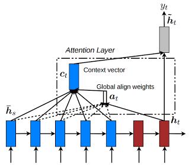

In addition to standard dimension settings like the number of layers, the hidden dimension size, etc., OpenNMT also provides various model architecture.

## Encoders

### Default encoder

The default encoder is a simple recurrent neural network (LSTM or GRU).

### Bidirectional encoder

The bidirectional encoder (`-encoder_type brnn`) consists of two independent encoders: one encoding the normal sequence and the other the reversed sequence. The output and final states are concatenated or summed depending on the `-brnn_merge` option.

### Pyramidal deep bidirectional encoder

The pyramidal deep bidirectional encoder (`-encoder_type pdbrnn`) is an alternative bidirectional encoder that reduces the time dimension after **each** layer based on the `-pdbrnn_reduction` factor and using `-pdbrnn_merge` as the reduction action (sum or concatenation).

### Deep bidirectional encoder

The deep bidirectional encoder (`-encoder_type dbrnn`) is an alternative bidirectional encoder where the outputs of every layers are summed (or concatenated) prior feeding to the next layer. It is a special case of a pyramidal deep bidirectional encoder without time reduction (i.e. `-pdbrnn_reduction = 1`).

### Google's NMT encoder

The Google encoder (`-encoder_type gnmt`) is an encoder with a single bidirectional layer as described in [Wu et al. (2016)](../references.md#GNMT). The bidirectional states are concatenated and residual connections are enabled by default.

### Convolutional encoder

The convolutional encoder (`-encoder_type cnn`) is an encoder based on several convolutional layers as described in [Gehring et al. (2017)](../references.md#CNNEncoder).

In sequence-to-sequence models, it should be used either without a bridge or with a dense bridge (options `-bridge dense`, `-bridge dense_nonlinear`, or `-bridge none`). The default `copy` bridge is not compatible with this encoder.

It is also recommended to set a small learning rate when using SGD (e.g. `-learning_rate 0.1`) or use Adam instead (e.g. `-optim adam -learning_rate 0.0002`).

## Decoders

### Default decoder

The default decoder applies attention over the source sequence and implements input feeding by default.

Input feeding is an approach to feed attentional vectors "*as inputs to the next time steps to inform the model about past alignment decisions*" ([Luong et al. (2015)](https://arxiv.org/pdf/1508.04025.pdf)). This can be disabled by setting `-input_feed 0`.

## Residual connections

With residual connections the input of a layer is element-wise added to the output before feeding to the next layer. This approach proved to be useful for the gradient flow with deep RNN stacks (more than 4 layers).

The following components support residual connections with the `-residual` flag:

* default encoder
* bidirectional encoder
* default decoder

## Bridges

A bridge is an additional layer between the encoder and the decoder that defines how to pass the encoder states to the decoder. It can be one of the following:

* `-bridge copy` (default): the encoder states are copied
* `-bridge dense`: the encoder states are forwaded through a dense layer
* `-bridge dense_nonlinear`: the encoder states are forwaded through a dense layer followed by a non-linearity, here \(tanh\)
* `-bridge none`: the encoder states are not passed and the decoder initial states are set to zero

With the `copy` bridge, encoder and decoder should have the same structure (number of layers, final hidden size, etc.).

## Attention Model

Different models are available from [Luong (2015)](../references.md#Luong2015) "Global Attention Model".

where:

$$a_t(s) = \frac{\mathrm{exp}(\mathrm{score}(h_t,\bar{h}_s))}{\sum_{s'} \mathrm{exp}(\mathrm{score}(h_t,\bar{h}_s)}$$

and the score function is one of these:

* `dot`: $$\mathrm{score}(h_t,\bar{h}_s)=h_t^T\bar{h}_s$$
* `general`: $$\mathrm{score}(h_t,\bar{h}_s)=h_t^TW_a\bar{h}_s$$
* `concat`: $$\mathrm{score}(h_t,\bar{h}_s)=\nu_a^T.\mathrm{tanh}(W_a[h_t;\bar{h}_s])$$

The model is selected using `-global_attention` option or can be disabled with `-attention none` option. The default attention model is `general`.

## Scheduled Sampling

By default, the decoder at step \(t\) is using the reference token for step \(t-1\) to calculate the new output. For some applications, for instance speech recognition, this is leading to propagation of decoding errors and also a mismatch between training and inference workflow. Scheduled sampling (as introduced in [Scheduled sampling for sequence prediction with recurrent neural networks](http://papers.nips.cc/paper/5956-scheduled-sampling-for-sequence-prediction-with-recurrent-neural-networks.pdf). In Advances in Neural Information Processing Systems (pp. 1171-1179).]) is allowing to mix gold reference and generated output in a proportion that will change over time: at the beginning of the training the generated output confidence is very low and it is better to use gold reference, while at the end of the training, we have to rely on generated output to have training in the same conditions than inference.

Scheduled sampling is activated with `-scheduled_sampling` parameter which takes the probability to use the reference token instead of the previously generated one. By default, probability is one meaning that we always use previously generated token. The sampling can be done either at each token level or at the sentence level using `-scheduled_sampling_scope` parameter. The decay of the sampling rate is controlled by parameters `-scheduled_sampling_decay_type` and `-scheduled_sampling_decay_rate`.
