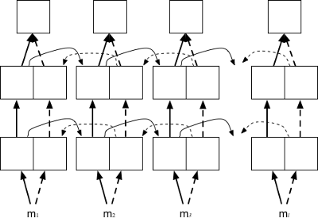
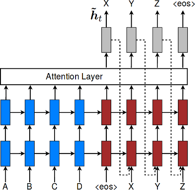
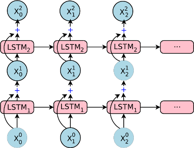

In addition to standard dimension settings like the number of layers, the hidden dimension size, etc., OpenNMT also provides various model architecture.

## Encoders

### Default encoder

The default encoder is a simple recurrent neural network (LSTM or GRU).

### Bidirectional encoder

The bidirectional encoder (`-brnn`) consists of two independent encoders: one encoding the normal sequence and the other the reversed sequence. The output and final states are concatenated or summed depending on the `-brnn_merge` option.

### Deep bidirectional encoder

The deep bidirectional encoder (`-dbrnn`) is an alternative bidirectional encoder where the output of **every** layers are summed (or concatenated) prior feeding to the next layer.

### Pyramidal deep bidirectional encoder

The pyramidal deep bidirectional encoder (`-pdbrnn`) is an alternative deep bidirectional encoder that reduces the time dimension at each layer based on `-pdbrnn_reduction`.

## Decoders

### Default decoder

The default decoder applies attention over the source sequence and implements input feeding by default.

Input feeding is an approach to feed attentional vectors "*as inputs to the next time steps to inform the model about past alignment decisions*" ([Luong et al. (2015)](https://arxiv.org/pdf/1508.04025.pdf)). This can be disabled by setting `-input_feed 0`.

## Residual connections

With residual connections the input of a layer is element-wise added to the output before feeding to the next layer. This approach proved to be useful for the gradient flow with deep RNN stacks (more than 4 layers).

The following components support residual connections with the `-residual` flag:

* default encoder
* bidirectional encoder
* default decoder

## Attention Model

Different options are available for attention modeling inspired from [Luong (2015)](../references.md#Luong2015).