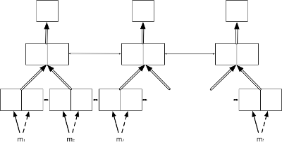

In addition to standard dimension settings like the number of layers, the hidden dimension size, etc., OpenNMT also provides various model architecture.

## Encoders

### Default encoder

The default encoder is a simple recurrent neural network (LSTM or GRU).

### Bidirectional encoder

The bidirectional encoder (`-brnn`) consists of two independent encoders: one encoding the normal sequence and the other the reversed sequence. The output and final states are concatenated or summed depending on the `-brnn_merge` option.

### Deep bidirectional encoder

The deep bidirectional encoder (`-dbrnn`) is an alternative bidirectional encoder where the output of **every** layers are summed (or concatenated) prior feeding to the next layer.

### Pyramidal deep bidirectional encoder

The pyramidal deep bidirectional encoder (`-pdbrnn`) is an alternative deep bidirectional encoder that reduces the time dimension at each layer based on `-pdbrnn_reduction`.

## Decoders

### Default decoder

The default decoder applies attention over the source sequence and implements input feeding by default.

Input feeding is an approach to feed attentional vectors "*as inputs to the next time steps to inform the model about past alignment decisions*" ([Luong et al. (2015)](https://arxiv.org/pdf/1508.04025.pdf)). This can be disabled by setting `-input_feed 0`.

## Residual connections

With residual connections the input of a layer is element-wise added to the output before feeding to the next layer. This approach proved to be useful for the gradient flow with deep RNN stacks (more than 4 layers).

The following components support residual connections with the `-residual` flag:

* default encoder
* bidirectional encoder
* default decoder

## Bridges

A bridge is an additional layer between the encoder and the decoder that defines how to pass the encoder states to the decoder. It can be one of the following:

* `-bridge copy` (default): the encoder states are copied
* `-bridge dense`: the encoder states are forwaded through a dense layer
* `-bridge dense_nonlinear`: the encoder states are forwaded through a dense layer followed by a non-linearity, here \(tanh\)
* `-bridge none`: the encoder states are not passed and the decoder initial states are set to zero

With the `copy` bridge, encoder and decoder should have the same structure (number of layers, final hidden size, etc.).

## Attention Model

Different models are available from [Luong (2015)](../references.md#Luong2015) "Global Attention Model".

where:

$$a_t(s) = \frac{\mathrm{exp}(\mathrm{score}(h_t,\bar{h}_s))}{\sum_{s'} \mathrm{exp}(\mathrm{score}(h_t,\bar{h}_s)}$$

and the score function is one of these:

* `dot`: $$\mathrm{score}(h_t,\bar{h}_s)=h_t^T\bar{h}_s$$
* `general`: $$\mathrm{score}(h_t,\bar{h}_s)=h_t^TW_a\bar{h}_s$$
* `concat`: $$\mathrm{score}(h_t,\bar{h}_s)=\nu_a^T.\mathrm{tanh}(W_a[h_t;\bar{h}_s])$$

The model is selected using `-global_attention` option or can be disabled with `-attention none` option. The default attention model is `general`.

## Generator

The default generator is a Linear+SoftMax layer.

### Noise-Contrastive Estimation

It is possible to use instead NCE ([Noise-Constrastive Estimation](https://www.cs.toronto.edu/%7Eamnih/papers/ncelm.pdf)) for the training - by using the `-criterion nce` parameter. NCE is particularly useful for very large target vocabulary size. The sample size used by NCE is set with `-nce_sample_size` and this parameter can be changed dynamically when reloading a model. When the model is released, the layer is converted into a regular Linear+SoftMax layer.

!!! warning "Warning"
    To use NCE training, you need to install dpnn libraries - do install the version from [here](https://github.com/jsenellart-systran/dpnn) which contains a patch for recent versions of torch.

