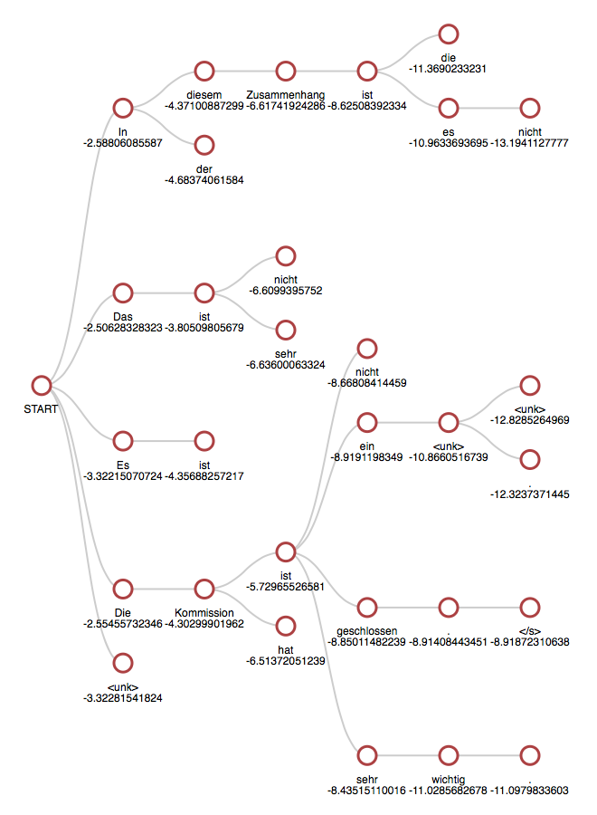

By default, translation is done using beam search. The `-beam_size` option can be used to trade-off translation time and search accuracy, with `-beam_size 1` giving greedy search. The small default beam size is often enough in practice.

Beam search can also be used to provide an approximate n-best list of translations by setting `-n_best` greater than 1. For analysis, the translation command also takes an oracle/gold `-tgt` file and will output a comparison of scores.

## Hypotheses filtering

The beam search provides a built-in filter based on unknown words: `-max_num_unks`. Hypotheses with more unknown words than this value are dropped.

!!! note "Note"
    As dropped hypotheses temporarily reduce the beam size, the `-pre_filter_factor` is a way to increase the number of considered hypotheses before applying filters.

## Normalization

The beam search also supports various normalization techniques that are disabled by default and can be used to biased the scores generated by the model:

$$s(Y,X)=\frac{\log P(Y|X)}{lp(Y)}+cp(X,Y)$$

where \(X\) is the source, \(Y\) is the current target, and the functions as defined below. An additional penalty on end of sentence tokens can also be added to prioritize longer sentences.

### Length normalization

Scores are normalized by the following formula as defined in [Wu et al. (2016)](../references.md#GNMT):

$$lp(Y) = \frac{(5+|Y|)^\alpha}{(5+1)^\alpha}$$

where \(|Y|\) is the current target length and \(\alpha\) is the length normalization coefficient `-length_norm`.

### Coverage normalization

Scores are penalized by the following formula as defined in [Wu et al. (2016)](../references.md#GNMT):

$$cp(X,Y) = \beta\sum_{i=1}^{|X|}\log(\min(\sum_{j=1}^{|Y|}p_{i,j},1.0))$$

where \(p_{i,j}\) is the attention probability of the \(j\)-th target word \(y_j\) on the \(i\)-th source word \(x_i\), \(|X|\) is the source length, \(|Y|\) is the current target length and \(\beta\) is the coverage normalization coefficient `-coverage_norm`.

### End of sentence normalization

The score of the end of sentence token is penalized by the following formula:

$$ep(X,Y)=\gamma\frac{|X|}{|Y|}$$

where \(|X|\) is the source length, \(|Y|\) is the current target length and \(\gamma\) is the end of sentence normalization coefficient `-eos_norm`.

## Visualizing the beam search

To visualize the beam search exploration, you can use the option `-save_beam_to beam.json`. It will save a JSON serialization of the beam search history.

!!! note "Note"
    This option requires the `dkjson` package.

This representation can then be visualized dynamically using the `generate_beam_viz.py` script from the [`OpenNMT/VisTools`](https://github.com/OpenNMT/VisTools) repository:

```bash
git clone https://github.com/OpenNMT/VisTools.git
cd VisTools
mkdir out/
python generate_beam_viz.py -d ~/OpenNMT/beam.json -o out/
firefox out/000000.html
```


